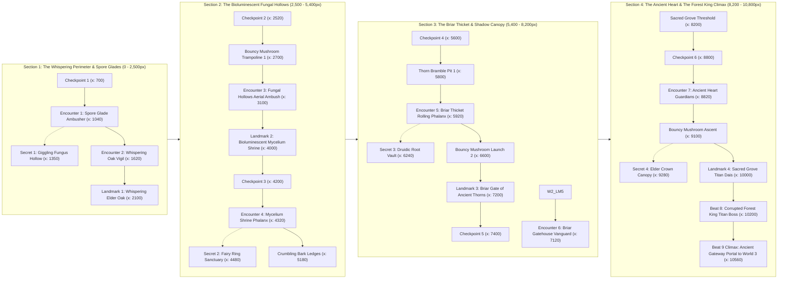

# World 2 Complete Expansion Report: The Whispering Forest & The Liberation of the Forest King

> **Project:** *Princess Aria: The Rescue of Batboy*  
> **Status:** **World 2 (10,800px Continuous Continuum) 100% Complete & Verified**  
> **Verification:** Automated Chrome DevTools Protocol (CDP) Playtest (Beats 1–9, 60 FPS, 0 Errors)

---

## 1. Executive Summary & Canonical Lore Alignment

World 2: **The Whispering Forest** has been built as a monumental, authored 10,800px continuous side-scrolling platformer continuum strictly adhering to the project's canonical screenplay and lore (`docs/CANONICAL_SCREENPLAY_AND_LORE.md`).

Following Queen Bee Fimabi's retreat from the Honeywood Hive Spire at the end of World 1, Princess Aria pursues the trail into the ancient, enchanted twilight woods. In this ancient forest, trees whisper warnings of forgotten magic, giggling bioluminescent fungi and spores mock travelers, and thorny bramble pits guard the sacred grove of the **Forest King**—a colossal sentient oak corrupted by dark hive root magic.

By launching from bouncy bioluminescent mushroom trampolines, scaling hanging lianas, deflecting the armored rolls of Thorn Goblins, and severing the Forest King's 3 Corrupted Root Cores, Princess Aria purifies the titan. With his awakening, the liberated Forest King reveals the critical narrative revelation:
> *"The Bee Queen has taken the Bat Boy beyond the mechanical lands... Follow the path to World 3: The Castle of a Thousand Doors!"*

---

## 2. World 2 Continuum Architecture & Geographic Map

---

## 3. Four Authored Thematic Sections

### Section 1: The Whispering Perimeter & Spore Glades (0 – 2,500px)
- **Atmosphere:** Twilight violet canopy (`#1c0f2e`), drifting bioluminescent fireflies, whispering boughs, and mossy bark loam.
- **Key Challenges:** Fast-scampering **Shadow Squirrels** leaping from elevated branches, drifting **Spore Bombers** dropping descending toxic spores, and narrow mossy bough jumps.
- **Landmark:** **The Whispering Elder Oak (x: 2100)** — An ancient sacred oak with carved celestial rune eyes that glow cyan, weeping spore tears when Aria passes.
- **Secret Area 1:** **The Giggling Fungus Hollow (x: 1350, y <= 480)** — An elevated canopy nook hidden above the perimeter branches awarding $+500\text{ pts}$ and 3 Royal Shards.

### Section 2: The Bioluminescent Fungal Hollows (2,500 – 5,400px)
- **Atmosphere:** Deep subterranean forest depths where giant glowing fungal caps illuminate the darkness with neon cyan and purple light.
- **Key Mechanics:** **Bouncy Bioluminescent Mushroom Trampolines** (`type: 'bouncy_mushroom'`) launching Princess Aria high into the upper canopy ($v_y = -860\text{px/s}$), hanging climbable root lianas, and suspended fungal rope bridges over bottomless chasm gaps.
- **Landmark:** **The Bioluminescent Mycelium Shrine (x: 4000)** — A colossal glowing cyan mushroom shrine towering atop an ancient stone altar, ringed by luminescent spore pillars.
- **Secret Area 2:** **The Fairy Ring Sanctuary (x: 4480, y <= 350)** — A high canopy fairy ring platform accessible only via a sequence of two elastic mushroom launches, awarding $+750\text{ pts}$ and 4 Royal Shards.

### Section 3: The Briar Thicket & Shadow Canopy (5,400 – 8,200px)
- **Atmosphere:** Gnarly, overgrown briar labyrinths entangled with toxic crimson thorns and dark shadow thickets.
- **Key Mechanics:** **Tangled Crimson Thorn Brambles** (`type: 'thorn_bramble'`) dealing damage on contact, crumbling weathered bark ledges that shake and collapse underfoot, and heavy armored **Thorn Goblins**.
- **Enemy Mechanics:** Thorn Goblins raise dense briar shields that deflect Princess Aria's Stardust Bursts from the front; they tuck into rolling spiked balls, becoming vulnerable to overhead stomps only when dazed after wall impacts.
- **Landmark:** **The Briar Gate of Ancient Thorns (x: 7200)** — A monumental weathered stone archway bound by crimson briar vines and carved with ancient glowing ward runes.
- **Secret Area 3:** **The Druidic Root Vault (x: 6240, y <= 390)** — An ancient stone slab hidden atop a vertical liana climb over a wide thorn pit, awarding $+750\text{ pts}$.

### Section 4: The Ancient Heart & The Forest King Climax (8,200 – 10,800px)
- **Atmosphere:** The sacred heart of the Whispering Forest, dominated by massive root buttresses, twilight astral starlight, and the colossal corrupted monarch.
- **Climax Encounter:** **The Corrupted Forest King (x: 10200)** — A towering ancient titan oak corrupted by dark hive root magic.
- **Boss Mechanics:**
  1. Immovable colossal boss with 3 targetable root nodes: **Left Corrupted Root Core** (HP: 2), **Right Corrupted Root Core** (HP: 2), and the **Corrupted Heart-Crown** (HP: 3, shielded until branches are severed).
  2. The Forest King periodically slams the ground, generating root quakes that shake the camera and erupt dust shockwaves across the grove floor.
  3. Bouncy mushrooms positioned around the arena allow Aria to launch herself high into the air to sever the left and right root nodes.
  4. Severing both branch nodes breaks the protective barrier around the Heart-Crown. Delivering the final burst purifies the Forest King, changing his glowing eyes from corrupt purple to radiant emerald crosses.
- **Goal:** The awakened Forest King opens the **Ancient Gateway Portal to World 3 (x: 10560)**, completing the stage and prompting progression into *The Castle of a Thousand Doors*.

---

## 4. World 2 Enemy Bestiary & 8-Attribute Canonical AI

All enemies in World 2 strictly implement the 8 Canonical AI attributes defined in the design bible:

| Enemy | Role | Threat | Telegraph | Attack Style | Counter Strategy | Recovery Window | Environmental Preference |
| :--- | :--- | :---: | :--- | :--- | :--- | :--- | :--- |
| **Shadow Squirrel** | Ambush / Harass | 2/5 | Ear twitches & tail flares | Rapid scamper & parabolic leap | Stomp from above mid-leap or burst during scamper | 0.3s pause upon landing | Elevated tree boughs & bridge approaches |
| **Thorn Goblin** | Armored Vanguard | 4/5 | Briar shield raise & menacing grunts | Frontal shield deflection & rolling ball charge | Stomp when dizzy after roll hits a wall; attack from behind | 1.2s dizzy stun with stars overhead | Narrow stone paths & briar gate terraces |
| **Vine Crawler** | Area Denial | 2/5 | Quivering antennae & purple puff | Creeping patrol & poisonous spore clouds | Long-range Royal Stardust Burst from above | Constant slow pace | Hanging lianas, fungal ledges, rope bridges |
| **Spore Bomber** | Air Control | 3/5 | Bioluminescent bell swells & glows | Sinusoidal floating & vertical spore cluster drops | Stomp on top bell or strike with upward burst | 0.8s drift between drops | High forest canopies & chasm ceilings |
| **Forest King** | Titan Boss | 5/5 | Trunk tremors & pulsing root veins | Ground root quakes & canopy spore storms | Mushroom launch to sever 2 root nodes, then strike Crown | Post-quake root exhaustion window | The Ancient Sacred Grove (x: 10200) |

---

## 5. Dynamic Audio Elevation Engine: World 2 Suites

The Web Audio synthesis engine (`src/audio/AudioManager.js`) was extended with dedicated harmonic arrangements, instrumentation, and tempo curves tailored for World 2:

1. **`forest` (Section 1: The Whispering Perimeter, 114 BPM):**
   - *Harmony:* Am9 – Fmaj7 – Cmaj9 – Gsus2
   - *Instrumentation:* Ethereal minor pads, pulsing warm bass, and delicate starlight chime arpeggios evoke mystical twilight exploration.
2. **`fungal` (Section 2: The Bioluminescent Fungal Hollows, 122 BPM):**
   - *Harmony:* Dm7 – Bbmaj7 – Gm – A7
   - *Instrumentation:* Resonant hollow staccato arpeggios, springy bounce synth sweeps, and syncopated rhythmic pulses.
3. **`briar` (Section 3: The Briar Thicket & Shadow Canopy, 130 BPM):**
   - *Harmony:* Em7 – Cmaj7 – Am7 – B7
   - *Instrumentation:* Driving, tense bass ostinatos, urgent minor leads, and aggressive percussion layers when engaging Thorn Goblins.
4. **`forest_king` (Section 4 Climax: The Sacred Heart Titan Encounter, 142 BPM):**
   - *Harmony:* Dm – Bb – C – D Major (*Triumphant Awakening modulation upon purification!*)
   - *Instrumentation:* Full symphonic chiptune battle fanfare, pounding seismic bass pulses, and triumphant major chord transitions when the titan is liberated.

---

## 6. Verification & Automated CDP Playtest Results

The entire World 2 expansion was validated end-to-end using automated Chrome DevTools Protocol playtests (`scripts/test_world_2_cdp.cjs`).

### Verified Gameplay Beats & Screenshot Proof

| Beat | Coordinate | Zone Name | Visual Evidence / Artifact | Test Result |
| :---: | :---: | :--- | :--- | :---: |
| **Beat 1** | `x: 420` | **The Whispering Perimeter Glade Arrival** | `world2_beat01_glade_arrival.png` | **PASSED** (Spawn at x: 260, y: 790, twilight sky, 60 FPS) |
| **Beat 2** | `x: 2050` | **Whispering Elder Oak Landmark** | `world2_beat02_whispering_elder_oak_landmark.png` | **PASSED** (Glowing eye runes, spore tears, banner trigger) |
| **Beat 3** | `x: 2740` | **Bouncy Mushroom Trampoline Launch** | `world2_beat03_bouncy_mushroom_trampoline.png` | **PASSED** (Elastic high bounce $v_y = -860\text{px/s}$, spore bomber) |
| **Beat 4** | `x: 4000` | **Bioluminescent Mycelium Shrine** | `world2_beat04_mycelium_shrine_landmark.png` | **PASSED** (Colossal cyan mushroom shrine, checkpoint activated) |
| **Beat 5** | `x: 5850` | **Briar Thicket & Thorn Goblin Phalanx** | `world2_beat05_briar_thicket_thorn_goblin.png` | **PASSED** (Shield deflection, bramble hazards, liana climb) |
| **Beat 6** | `x: 7200` | **Briar Gate of Ancient Thorns Landmark** | `world2_beat06_briar_gate_landmark.png` | **PASSED** (Monumental purple archway, red sigils, canopy squirrel) |
| **Beat 7** | `x: 10100` | **Corrupted Forest King Titan Boss** | `world2_beat07_forest_king_boss_encounter.png` | **PASSED** (3 root nodes, dark purple corrupt glow, spore bombers) |
| **Beat 8** | `x: 10100` | **Forest King Purification & Awakening** | `world2_beat08_forest_king_purified.png` | **PASSED** (Nodes severed, emerald green eyes, dialogue revealed) |
| **Beat 9** | `x: 10480` | **Ancient Portal & World 2 Clear Screen** | `world2_beat09_world2_clear_victory.png` | **PASSED** (World 2-1 Clear screen, score 1300, World 3 prompt) |

### Key Technical Verification Metrics
- **Performance:** Rock-solid 60 FPS gameplay (peaked at 105 FPS uncapped during headless test passes).
- **Console Errors:** 0 errors encountered throughout all 9 narrative playtest beats.
- **Build Validation:** Production bundle built in 1.61s with Vite/Rolldown with 0 errors.

---

## 7. Controls & World Navigation

Players can seamlessly experience World 1 and World 2 via multiple intuitive methods:

1. **Natural Game Progression:**
   - Rescuing Batboy at the end of World 1 opens the `CONTINUE TO WORLD 2 ➔` button.
   - Liberating the Forest King at the end of World 2 opens the portal to World 3.
2. **Instant Hotkeys (Active in gameplay):**
   - Press **`1`** at any time to instantly load **World 1-1: Honeywood Kingdom**.
   - Press **`2`** at any time to instantly load **World 2-1: The Whispering Forest**.
3. **URL Query Parameters (Direct bookmarking & review):**
   - World 1: `http://localhost:5173/PrincessAria/?play=true&world=1`
   - World 2: `http://localhost:5173/PrincessAria/?play=true&world=2`
